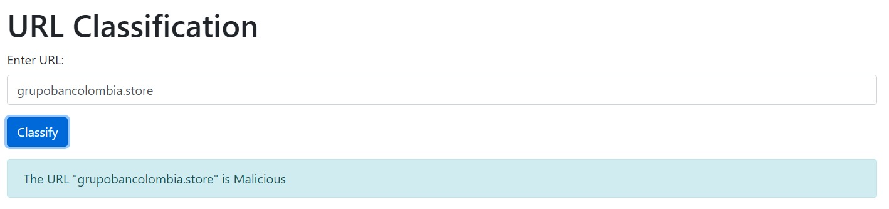

# Malicious-URL-Detector

## Overview
This project implements a machine learning model to classify URLs as either "Malicious" or "Benign". It utilizes a Random Forest Classifier trained on a dataset containing various features extracted from URLs.

## Dataset
Source: Kaggle Dataset - [link](https://www.kaggle.com/datasets/pilarpieiro/tabular-dataset-ready-for-malicious-url-detection)

Description: This dataset includes features covering aspects such as URL structure, domain information, character frequencies, and more. It facilitates the development and evaluation of URL classification models in cybersecurity.

## Model Development
Features Used: A set of 22 important features extracted from URLs, including length, entropy, domain details, path and query components.

Model: Random Forest Classifier trained using hyperparameter tuning via GridSearchCV for optimal performance.
Performance: Achieved an accuracy of 92.33% on the test dataset.

## Usage
### Training and Evaluation:
- Run url_classifier.py to train the model using the provided dataset.
- Evaluate model performance using metrics like accuracy, precision, recall, and F1-score.

### Deployment as Flask App:
- The model is deployed as a web application (app.py) using Flask.
- Users can input a URL and get real-time classification results on whether it is "Malicious" or "Benign".

## Files Included
- url_classifier.py: Script for training the Random Forest model.
- app.py: Flask web application for URL classification.
- extract_features.py: Module for extracting URL features.
- url_classifier_model.pkl: Saved trained model.
- scaler.pkl: Saved scaler for feature scaling.

## How to Run
- Train the model by running url_classifier.py.
- Start the Flask app with python app.py.
- Access the app via http://localhost:5000 in your web browser.

## Result

